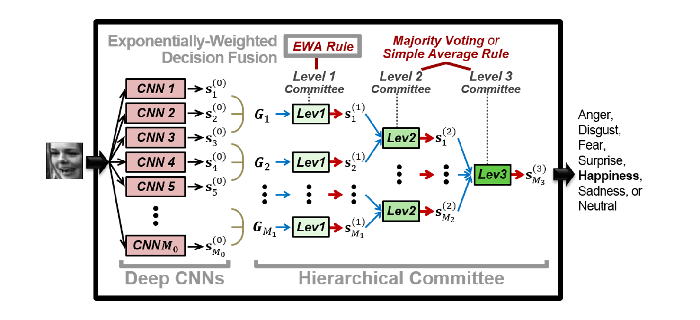

# Hierarchical Committee of CNNs for Facial Expression Recognition

MatConvNet-based MATLAB implementation for

* [Challenge] Winner of SFEW Part, The 3rd Emotion Recognition in the Wild Challenge ([EmotiW’15](https://cs.anu.edu.au/few/emotiw2015.html)), 2015
* [Paper] "[Hierarchical Committee of Deep Convolutional Neural Networks for Robust Facial Expression Recognition](https://link.springer.com/article/10.1007/s12193-015-0209-0)," Journal on Multimodal User Interfaces (JMUI), 2016




## 1. Input Pre-processing

* Forder `lib1_AlignFace_NormalizeInput` include
  - codes for **face registration** (multi-pipeline-based alignment)
  - codes for **input normalization** (illumination normalization, contrast enhancement) + **input matrix** (imdb) formation for MatConvNet toolbox 
  - Download the following libraries for face registration
    + `/pipeline_modules_functions/module1_ZR_FaceDetector`
      + visit https://www.ics.uci.edu/~xzhu/face/ → download and unzip "face-release1.0-basic.zip" → move the unzipped files to "module1_ZR_FaceDetector"
    + `/pipeline_modules_functions/module3_INTRAFACE_LandmarkDetector`
      + visit http://humansensing.cs.cmu.edu/intraface/download_functions_matlab.html → download and unzip "FacialFeatureDetection&Tracking_v1.4.0.zip" → move the files to "module3_INTRAFACE_LandmarkDetector"
 
## 2. Individual CNNs

* Forder `lib2_TrainDeepCNN` includes
  - codes to train individual CNNs
    + based on MatConvNet toolbox (version1.0-beta8)

## 3. Hierarchical Committee (Ensemble) of CNNs

* Forder `lib3_HierarchicalCommittee` includes
  - codes to form hierarchical committee of CNNs
    + single-level & two-level committees

## Notice
  - Due to memory and license issues, we cannot entirely provide the datasets (SFEW2.0, FER-2013, TFD) and all the trained models (240 CNNs) used in our paper.
  - However, this repository includes executable codes for some sample data. We believe that you can obtain the results in our paper if you use full data and train whole models.

## Citation
If you plan to use our codes, please consider citing our paper:
```
@article{kim2016hierarchical,
  title={Hierarchical committee of deep convolutional neural networks for robust facial expression recognition},
  author={Kim, Bo-Kyeong and Roh, Jihyeon and Dong, Suh-Yeon and Lee, Soo-Young},
  journal={Journal on Multimodal User Interfaces},
  volume={10},
  number={2},
  pages={173--189},
  year={2016},
  publisher={Springer}
}
```  
```  
@inproceedings{kim2015hierarchical,
  title={Hierarchical committee of deep cnns with exponentially-weighted decision fusion for static facial expression recognition},
  author={Kim, Bo-Kyeong and Lee, Hwaran and Roh, Jihyeon and Lee, Soo-Young},
  booktitle={Proceedings of the 2015 ACM on International Conference on Multimodal Interaction},
  pages={427--434},
  year={2015}
}
```  